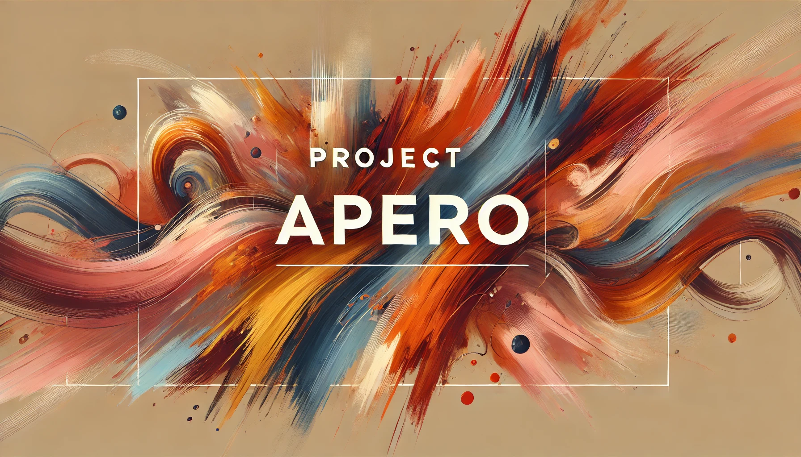

# Project Apero

## Table of Contents
- [Introduction](#introduction)
- [Features](#features)
<!-- - [Demo](#demo) -->
- [Installation](#installation)
- [Usage](#usage)
- [Chatbot Integration](#chatbot-integration)
- [Data](#data)
- [Modeling](#modeling)
- [Docker Setup](#docker-setup)
- [Project Structure](#project-structure)
- [License](#license)
- [Contact](#contact)

## Introduction

**Project Apero** is an advanced recommendation system designed to enhance user experience by providing personalized suggestions based on user behavior and preferences. Leveraging modern technologies such as Streamlit for the frontend and Rasa for chatbot integration, this project aims to deliver an intuitive and efficient system for diverse applications.

## Features

- **Interactive Web Interface:** Built with Streamlit, offering a seamless and responsive user experience.
- **Personalized Recommendations:** Utilizes Scikit-Learn algorithms to provide tailored suggestions.
- **Data Analysis & Visualization:** Employs Pandas and Matplotlib for insightful data analysis and visualization.
- **Chatbot Support:** Integrates a Rasa-powered chatbot to assist users and enhance interaction.
- **Robust Data Handling:** Implements strategies for outlier detection and augmentation with realistic fake data.

<!-- ## Demo -->

<!--  -->

<!-- Experience a live demonstration of Project Apero [here](https://your-deployment-url.com). -->

## Installation

### Prerequisites

- **Docker & Docker Compose:** Ensure Docker and Docker Compose are installed on your system.
- **Git:** For cloning the repository and managing submodules.

### Steps v1

1. **Clone the Repository:**
    ```bash
    git clone https://github.com/yourusername/project-apero.git
    cd project-apero
    ```

2. **Set Up Virtual Environment:**
    ```bash
    py -3.9 -m venv venv 
    source venv/bin/activate  # On Windows: venv\Scripts\activate
    ```

3. **Install Dependencies:**
    ```bash
    pip install --upgrade pip
    pip install -r requirements.txt
    ```

## Usage v1

### Running the Streamlit App

```bash
streamlit run src/app.py
```

## Steps v2

1. **Clone the Repository:**
    ```bash
    git clone https://github.com/yourusername/project-apero.git
    cd project-apero
    ```

2. **Build and Start Services:**
    ```bash
    docker-compose up --build
    ```

    This command builds the Docker images and starts all services as defined in `docker-compose.yml`.

## Usage v2

Access the application at `http://localhost:8501`.

### Accessing the Application

- **Streamlit App:** Open your browser and navigate to [http://localhost:8501](http://localhost:8501) to access the interactive web interface.

### Interacting with the Chatbot

- The integrated Rasa chatbot is accessible within the Streamlit interface.
- Ensure the Rasa server is running (handled by Docker Compose).
- Use the chatbot to get personalized recommendations and assistance based on your interactions.

## Chatbot Integration

### Overview

The chatbot is built using the Rasa framework and is designed to interact contextually with the data analysis results presented on the Streamlit app. It can assist users in navigating the application, provide recommendations, and answer queries related to the data insights.

### Features

- **Context-Aware Conversations:** Understands the context from user interactions and provides relevant responses.
- **Data-Driven Responses:** Fetches and presents data analysis results upon user requests.
- **Seamless Integration:** Embedded within the Streamlit app for a unified user experience.

### Configuration

- **Rasa Server:** Runs on port `5005`.
- **Rasa Action Server:** Runs on port `5055`.
- **Streamlit App:** Communicates with the Rasa server via the Docker network.

### Custom Actions

Custom actions are implemented in `actions/actions.py` to enable the chatbot to fetch and present data analysis results. These actions interact with the Streamlit app's data processing modules to retrieve relevant insights based on user queries.

## Data

### Dataset

We utilize the [Stroke Prediction Dataset](https://www.kaggle.com/datasets/fedesoriano/stroke-prediction-dataset) from Kaggle for training and evaluation.

### Data Handling

- **Outlier Detection:** Implemented using the Z-score method to identify and handle anomalies.
- **Data Augmentation:** Added 30% realistic synthetic data to enhance dataset robustness.
- **Data Transformation:** Normalized numerical features following best practices outlined in [Google's Machine Learning Crash Course](https://developers.google.com/machine-learning/crash-course/numerical-data).

### Data Pipeline

The data pipeline is managed within the `data/` directory, ensuring organized data processing and management.

## Modeling

### Algorithms

- **Random Forest Classifier:** Chosen for its robustness and ability to handle feature interactions.
- **Support Vector Machine (SVM):** Utilized for its effectiveness in high-dimensional spaces.

### Model Training

Models are trained using Scikit-Learn, with performance evaluated based on accuracy, precision, recall, and F1-score. The best-performing model is integrated into the Streamlit app for generating personalized recommendations.

## Docker Setup

The project is containerized using Docker and orchestrated with Docker Compose to ensure consistent environments across development and production.

### Services

- **Rasa Server (`rasa`):** Handles natural language understanding (NLU) and dialogue management.
- **Rasa Action Server (`rasa_action`):** Executes custom actions defined in the project.
- **Streamlit App (`streamlit`):** Provides the interactive frontend for users.
- **Duckling (`duckling`):** (Optional) Extracts entities like dates, times, and numbers from user inputs.

### Running the Services

Ensure Docker and Docker Compose are installed, then execute:

```bash
docker-compose up --build
```

### Accessing Services

- **Streamlit App:** [http://localhost:8501](http://localhost:8501)
- **Rasa Server:** [http://localhost:5005](http://localhost:5005)
- **Rasa Action Server:** [http://localhost:5055](http://localhost:5055)
- **Duckling (Optional):** [http://localhost:8000](http://localhost:8000)

## Project Structure

```
project-apero/
├── actions/
│   ├── actions.py
│   ├── requirements-actions.txt
│   └── ...
├── data/
│   ├── nlu.yml
│   ├── stories.yml
│   └── ...
├── models/
│   └── ...
├── src/
│   ├── app.py
│   ├── chatbot/
│   │   ├── rasa_chatbot.py
│   │   └── ...
│   └── ...
├── Dockerfile
├── docker-compose.yml
├── requirements.txt
├── README.md
├── .gitignore
└── ...
```

## License

This project is licensed under the [GNU GENERAL PUBLIC LICENSE](./LICENSE).

## Contact

For any inquiries or support, please open an issue in the [GitHub Repository](https://github.com/hlexnc/project-apero). 