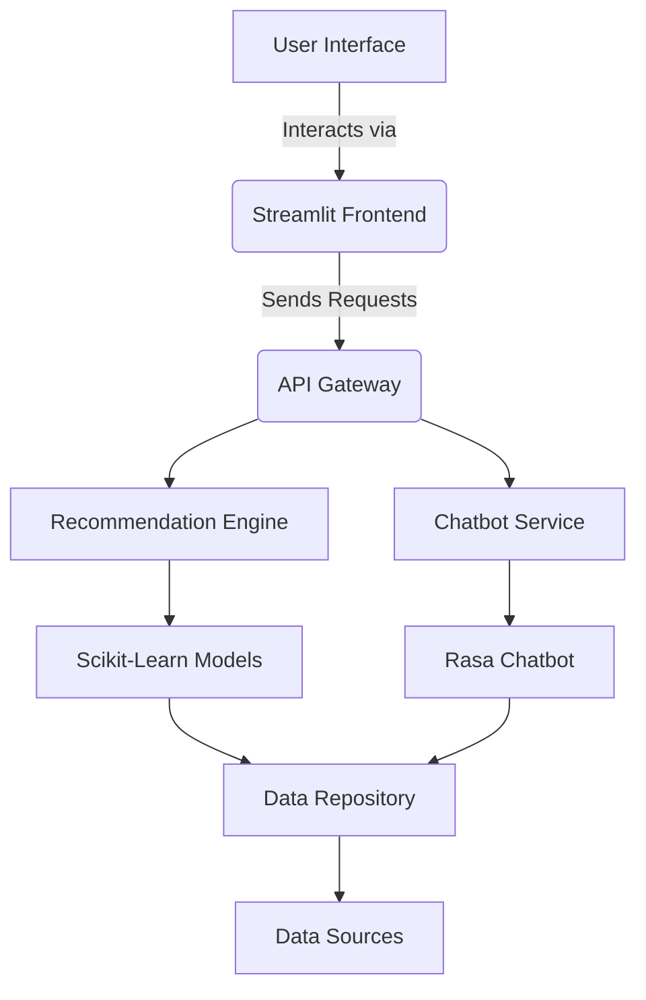
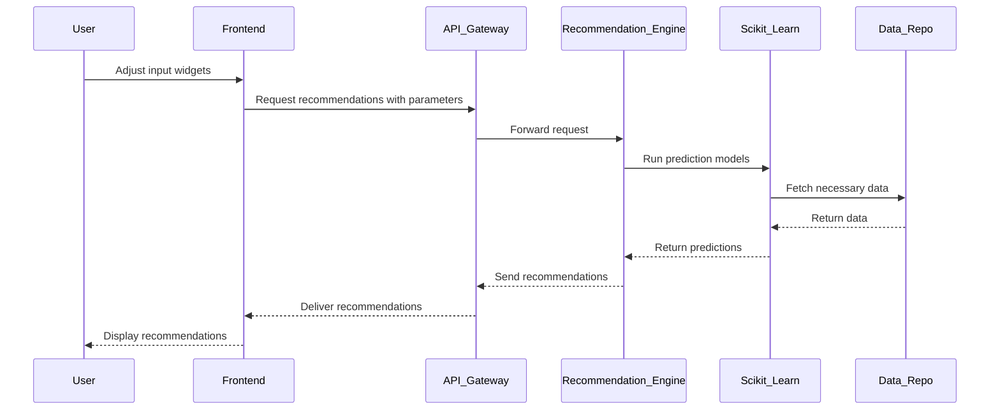
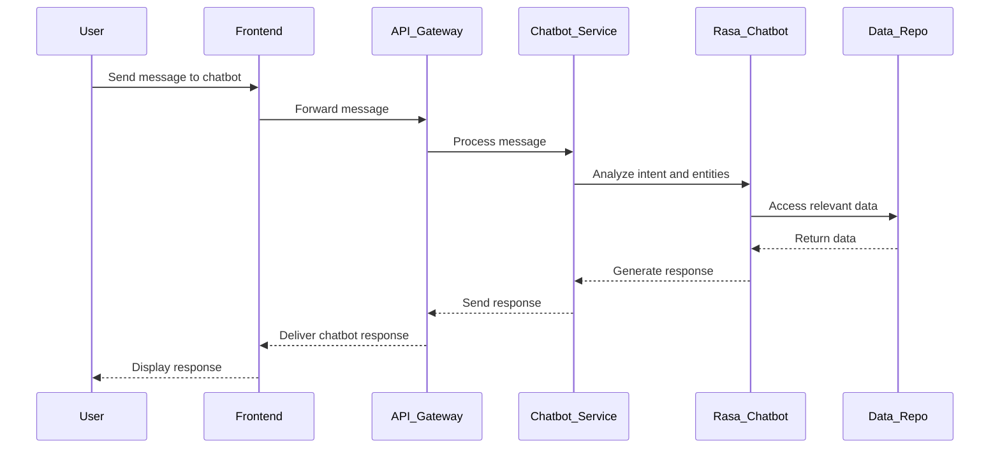
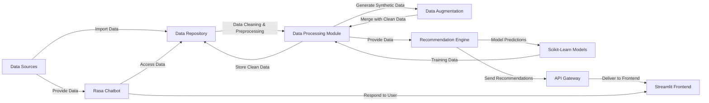

# System Design Document

## Assistance Systems Project (AIN-B)

### Table of Contents
1. [Introduction](#introduction)
2. [High-Level Architecture](#high-level-architecture)
3. [Sequence Diagrams](#sequence-diagrams)
4. [Data Flow Mapping](#data-flow-mapping)
5. [Technology Stack Confirmation](#technology-stack-confirmation)
6. [Conclusion](#conclusion)

---

## Introduction

The **Assistance Systems Project (AIN-B)** aims to develop a data-driven recommendation system integrated with a chatbot to enhance user interaction and provide personalized suggestions. Leveraging technologies such as Streamlit for the frontend, Rasa for chatbot functionality, and Pandas for data manipulation, the project seeks to deliver an efficient and intuitive system tailored to user needs.

This document outlines the system architecture, data flow, and validates the chosen technology stack against project requirements, ensuring a robust foundation for successful implementation.

---

## High-Level Architecture

The high-level architecture of the project encompasses the primary components and their interactions. The system is divided into three main layers: **Frontend**, **Backend**, and **Data Processing**.

**Components:**

- **User Interface (UI):** Facilitates user interaction through a web-based interface.
- **Streamlit Frontend:** Provides the interactive web application for users.
- **API Gateway:** Manages and routes incoming requests to appropriate services.
- **Recommendation Engine:** Generates personalized recommendations using machine learning models.
- **Chatbot Service:** Handles user queries and interactions via the Rasa chatbot.
- **Scikit-Learn Models:** Implements machine learning algorithms for prediction and recommendation tasks.
- **Rasa Chatbot:** Manages natural language understanding and dialogue management.
- **Data Repository:** Stores and manages datasets, including original and synthetic data.
- **Data Sources:** External sources from which data is imported and updated.

---

## Sequence Diagrams

### 1. Generating Recommendations

### 2. Chatbot Interaction

---

## Data Flow Mapping

The data flow within the system ensures efficient movement from data ingestion to user-facing recommendations and chatbot interactions.

**Components:**

- **Data Sources:** Originate data inputs from external repositories or user uploads.
- **Data Repository:** Centralized storage for original and processed data.
- **Data Processing Module:** Handles data cleaning, preprocessing, and transformation.
- **Data Augmentation:** Generates synthetic data to enhance dataset diversity.
- **Recommendation Engine:** Utilizes processed data to generate user-specific recommendations.
- **Scikit-Learn Models:** Implements machine learning algorithms for predictive analytics.
- **API Gateway:** Manages and routes data requests between frontend and backend services.
- **Rasa Chatbot:** Interfaces with users to provide assistance and gather inputs.
- **Streamlit Frontend:** Displays recommendations and facilitates user interactions.

**Potential Bottlenecks:**

- **Data Processing Module:** Intensive data cleaning and augmentation may lead to latency.
- **Scikit-Learn Models:** Complex model computations could delay recommendation generation.
- **API Gateway:** High traffic may overwhelm request routing, impacting response times.

**Points of Failure:**

- **Data Repository:** Data corruption or loss could disrupt the entire system.
- **Rasa Chatbot:** Failures in natural language processing can degrade user experience.
- **API Gateway:** Downtime or misrouting of requests can halt user interactions.

---

## Technology Stack Confirmation

The chosen technology stack—**Streamlit**, **Rasa**, and **Pandas**—has been evaluated against the project requirements to ensure optimal alignment and performance.

### 1. Streamlit

**Purpose:** Develops the interactive web-based frontend for the application.

**Justification:**
- **Ease of Use:** Simplifies the creation of interactive dashboards with minimal code.
- **Rapid Development:** Facilitates quick iteration and deployment, essential for project timelines.
- **Integration:** Seamlessly integrates with Python libraries like Pandas and Matplotlib for data visualization.

**Alternative Technologies:**
- **Dash by Plotly:** Offers more customization but requires more boilerplate code.
- **Flask/Django:** Provides greater flexibility but demands extensive setup for frontend components.

**Conclusion:** Streamlit is the optimal choice for its simplicity and efficiency in building interactive user interfaces within the project constraints.

### 2. Rasa

**Purpose:** Implements the chatbot functionality for user assistance and interaction.

**Justification:**
- **Open-Source:** Freely available with a robust community, ensuring continuous improvements.
- **Customization:** Allows detailed control over natural language understanding and dialogue management.
- **Integration:** Easily integrates with backend services via APIs, enhancing extensibility.

**Alternative Technologies:**
- **Dialogflow:** Offers a user-friendly interface but may incur costs and has less flexibility.
- **Microsoft Bot Framework:** Provides extensive features but can be complex to set up and manage.

**Conclusion:** Rasa is preferred for its flexibility, control, and cost-effectiveness, aligning well with the project's requirements for a customizable chatbot.

### 3. Pandas

**Purpose:** Handles data manipulation and analysis tasks within the application.

**Justification:**
- **Comprehensive Features:** Provides powerful data structures and functions for efficient data handling.
- **Integration:** Works seamlessly with other Python libraries like Scikit-Learn and Matplotlib.
- **Performance:** Optimized for handling large datasets, essential for the project's data processing needs.

**Alternative Technologies:**
- **Dask:** Suitable for parallel computing but introduces additional complexity.
- **NumPy:** Offers foundational support but lacks high-level data manipulation capabilities inherent in Pandas.

**Conclusion:** Pandas is the most suitable choice for data manipulation and analysis, offering the necessary features and performance required for the project.

### 4. Additional Technologies

- **Scikit-Learn:** For implementing machine learning models, essential for the recommendation engine.
- **PyDeck/Altair/Matplotlib:** For data visualization within the Streamlit frontend.
- **Git/MyGit:** For version control and collaboration, aligning with project setup requirements.
- **Virtual Environment (venv):** Ensures isolated and reproducible development environments.

**Validation Against Requirements:**
- **User Interface:** Streamlit meets the need for an interactive and responsive frontend.
- **Chatbot Integration:** Rasa fulfills the requirement for a customizable and intelligent chatbot.
- **Data Handling:** Pandas, complemented by Scikit-Learn, addresses data manipulation and machine learning needs effectively.
- **Documentation & Deployment:** Git and MyGit facilitate proper version control and collaboration as outlined in project setup.

---

## Conclusion

The selected technology stack of **Streamlit**, **Rasa**, and **Pandas**, supplemented by **Scikit-Learn** and visualization libraries, aligns perfectly with the project's functional and non-functional requirements. This combination ensures a robust, scalable, and user-friendly recommendation system integrated with an intelligent chatbot. The high-level architecture and data flow mappings provide a clear roadmap for development, while the validation confirms the suitability of chosen technologies. Moving forward, adherence to this design will facilitate efficient implementation and successful project outcomes.

---