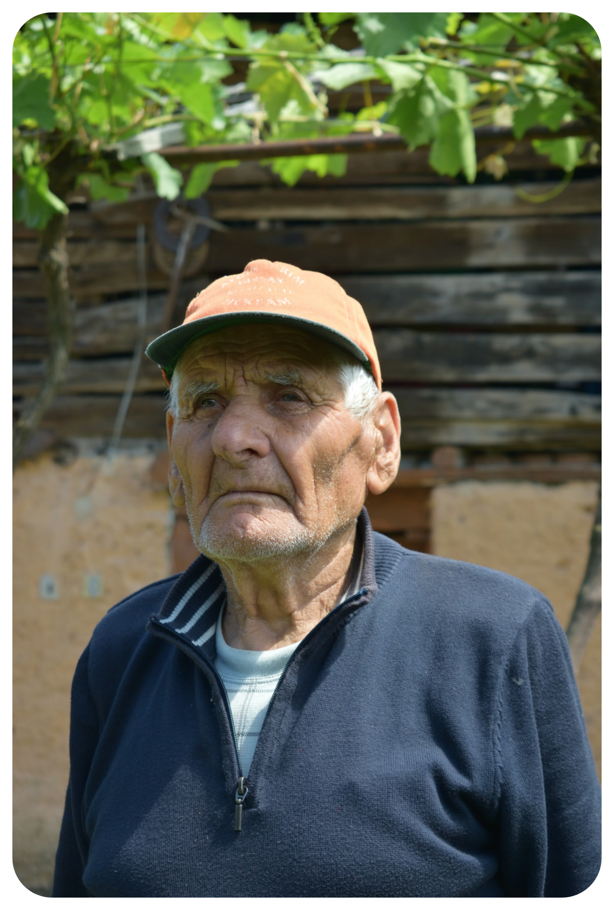

# **User Personas**

Understanding our users is crucial for designing an effective and user-friendly recommendation system. Below are three detailed personas representing the primary user groups for the **Assistance Systems Project**.

## **Persona 1: Health-Conscious Helen** 

### **Background**
- **Age:** 35
- **Occupation:** Marketing Manager
- **Education:** Bachelor's Degree in Business Administration
- **Location:** Urban area
- **Tech Savviness:** High

### **Demographics**
- **Gender:** Female
- **Marital Status:** Married
- **Family:** Two children

### **Goals**
- Maintain a healthy lifestyle through regular exercise and balanced nutrition.
- Seek personalized health recommendations to prevent potential health issues.
- Utilize technology to track and improve personal health metrics.

### **Frustrations**
- Overwhelmed by generic health advice that doesn't consider personal data.
- Difficulty in finding reliable tools that integrate seamlessly into her daily routine.
- Lack of time to analyze health data and derive meaningful insights.

### **Behavior**
- Regularly uses fitness apps and wearable devices to monitor health metrics.
- Prefers data-driven recommendations that are easy to understand and implement.
- Engages with digital tools that offer personalized and actionable insights.

### **How the Project Helps**
The **Assistance Systems Project** provides Helen with tailored health recommendations based on her personal data, helping her make informed decisions to maintain and improve her health efficiently.

---

## **Persona 2: Data Analyst David**  

### **Background**
- **Age:** 28
- **Occupation:** Data Analyst at a Tech Firm
- **Education:** Master's Degree in Data Science
- **Location:** Suburban area
- **Tech Savviness:** Expert

### **Demographics**
- **Gender:** Male
- **Marital Status:** Single
- **Family:** No children

### **Goals**
- Utilize advanced data analysis tools to derive actionable insights.
- Integrate chatbot functionalities to streamline data queries and recommendations.
- Enhance his workflow with efficient and reliable data processing systems.

### **Frustrations**
- Limited integration between data analysis tools and chatbots.
- Inadequate visualization options for complex data sets.
- Time-consuming processes for data cleaning and preprocessing.

### **Behavior**
- Frequently interacts with multiple data platforms and APIs.
- Prefers customizable and scalable solutions for data analysis.
- Values automation in repetitive tasks to focus on higher-level analysis.

### **How the Project Helps**
The **Assistance Systems Project** offers David robust data analysis capabilities combined with a responsive chatbot, enabling seamless data queries and personalized recommendations, thus enhancing his analytical workflow.

---

## **Persona 3: Senior Citizen Sam** 

### **Background**
- **Age:** 70
- **Occupation:** Retired Teacher
- **Education:** Bachelor's Degree in Education
- **Location:** Rural area
- **Tech Savviness:** Low to Moderate

### **Demographics**
- **Gender:** Male
- **Marital Status:** Widowed
- **Family:** One adult child

### **Goals**
- Monitor health indicators to maintain well-being in retirement.
- Access simple and understandable health recommendations.
- Seek assistance through user-friendly digital interfaces.

### **Frustrations**
- Intimidated by complex technology and interfaces.
- Prefers straightforward information without technical jargon.
- Limited experience with chatbots and automated systems.

### **Behavior**
- Uses basic technology like smartphones and tablets for communication and information.
- Relies on clear instructions and easy navigation in digital tools.
- Values reliability and accuracy in health-related information.

### **How the Project Helps**
The **Assistance Systems Project** provides Sam with an intuitive and accessible platform for monitoring his health, receiving personalized recommendations, and interacting with a chatbot designed to accommodate his comfort level with technology.

---
