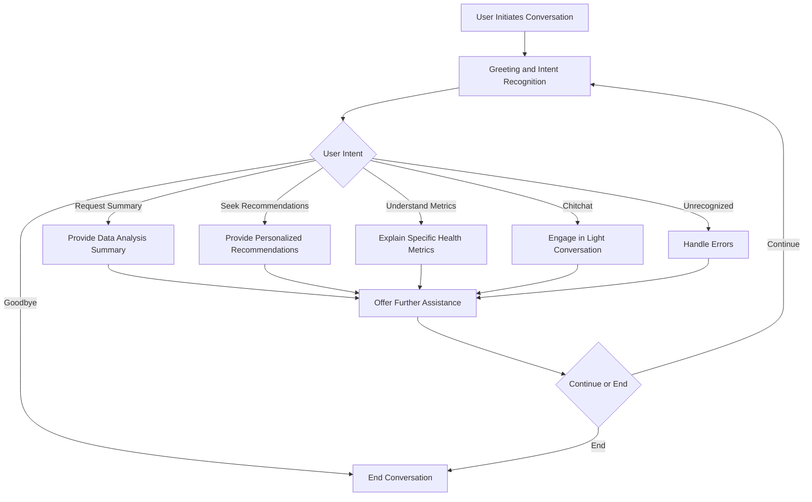

# **High-Level Dialog Flow for Chatbot Use Case**

Understanding the conversational flow is essential for designing an effective chatbot. Below is a high-level dialog flow diagram for the **Real-Time Health Queries and Recommendations** use case within the **Assistance Systems Project**.

## **1. Entry Point**

- **User Initiates Conversation:**
  - **Trigger:** User navigates to the Chatbot page and sends a greeting (e.g., "Hi", "Hello").
  
## **2. Greeting and Intent Recognition**

- **Chatbot Responds:**
  - Greets the user and offers assistance (e.g., "Hello! How can I assist you with your health today?").

- **Intent Recognition:**
  - Determines the user's intent based on the input (e.g., Greeting, Request for Data Summary, Health Recommendation).

## **3. Main Conversation Paths**

### **A. Request for Data Analysis Summary**

- **User Input:**
  - "Could you provide a summary of my latest data analysis?"

- **Chatbot Actions:**
  1. **Fetch Data:** Access user's latest data analysis results.
  2. **Generate Summary:** Compile key metrics and insights.
  3. **Respond:** Present the summary to the user.

- **Follow-Up:**
  - Offer personalized recommendations based on the summary.

### **B. Seeking Personalized Recommendations**

- **User Input:**
  - "I want to reduce my stroke risk. Any recommendations?"

- **Chatbot Actions:**
  1. **Analyze Data:** Review user's health metrics.
  2. **Generate Recommendations:** Provide actionable advice tailored to user's data.
  3. **Respond:** Share the recommendations with the user.

- **Follow-Up:**
  - Ask if the user needs more information or assistance.

### **C. Understanding Specific Health Metrics**

- **User Input:**
  - "Can you explain how my BMI affects my stroke risk?"

- **Chatbot Actions:**
  1. **Interpret Data:** Analyze the user's BMI in the context of stroke risk.
  2. **Provide Explanation:** Offer a clear and concise explanation.
  3. **Respond:** Deliver the information to the user.

- **Follow-Up:**
  - Offer further assistance or additional information.

### **D. General Health Queries and Chitchat**

- **User Input:**
  - "Tell me a joke."

- **Chatbot Actions:**
  1. **Detect Chitchat Intent:** Recognize non-health-related queries.
  2. **Respond Appropriately:** Share a joke or engage in light conversation.

- **Follow-Up:**
  - Redirect the conversation back to health-related topics if needed.

## **4. Error Handling and Out-of-Scope Responses**

- **Unrecognized Inputs:**
  - If the chatbot cannot understand the user's intent, it responds with a polite message (e.g., "I'm sorry, I didn't understand that. Could you please rephrase?").

- **Out-of-Scope Queries:**
  - For questions outside the chatbot's knowledge base, it responds with a message like, "I'm sorry, I can't help with that. Could you ask something else related to your health data?"

## **5. Ending the Conversation**

- **User Initiates Goodbye:**
  - **User Input:** "Goodbye"

- **Chatbot Responds:**
  - Acknowledges the farewell and ends the session (e.g., "Goodbye! Have a great day!").

## **6. Persistent Context and Session Management**

- **Session Identification:**
  - Each user session is uniquely identified to maintain context across multiple interactions.

- **Contextual Awareness:**
  - The chatbot retains relevant information throughout the session to provide coherent and context-aware responses.

## **7. Feedback and Continuous Improvement**

- **User Feedback:**
  - Users can provide feedback on chatbot responses to help improve its performance.

- **Data Logging:**
  - Conversations are logged (anonymously) for analysis and enhancement of chatbot capabilities.

---

**Visual Representation:**

Below is a simplified diagram illustrating the high-level dialog flow:

---

**Conclusion**

The high-level dialog flow ensures that the chatbot provides a structured and intuitive interaction experience for users. By addressing various intents and maintaining contextual awareness, the chatbot effectively serves as a personalized health assistant within the **Assistance Systems Project**.

---